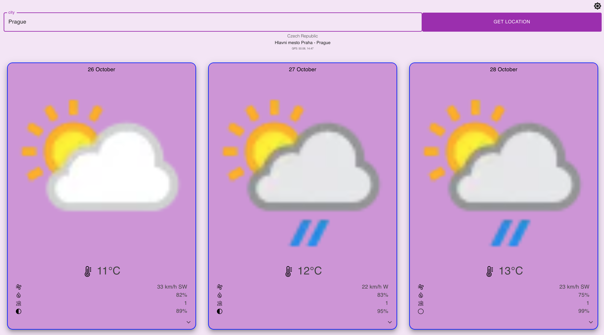
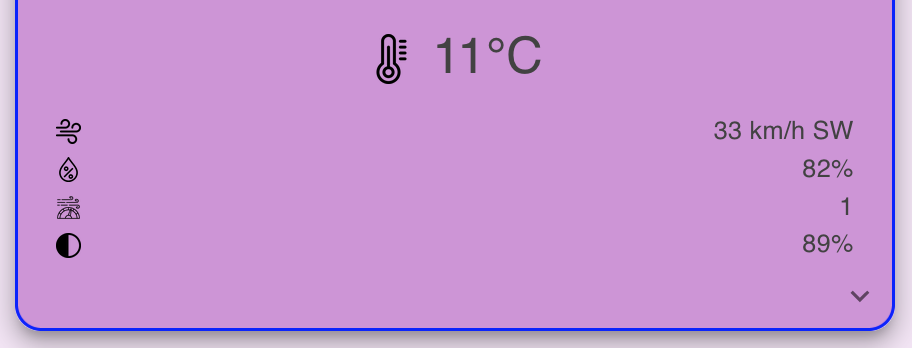
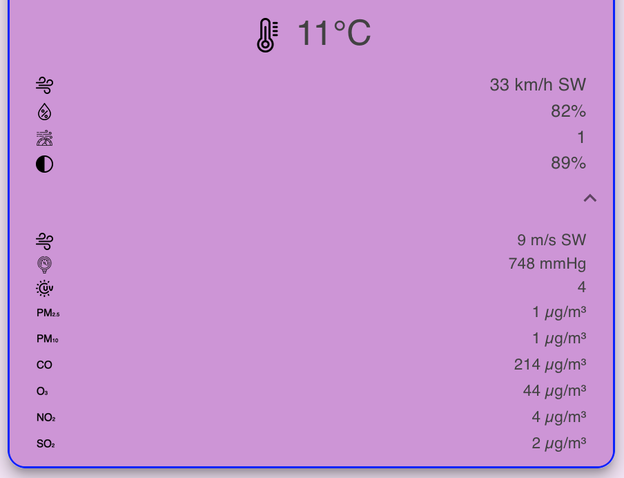

# Weather App

<!-- TABLE OF CONTENTS -->
<details>
  <summary>Table of Contents</summary>
  <ol>
    <li>
      <a href="#about-the-project">About The Project</a>
      <ul>
        <li><a href="#built-with">Built With</a></li>
        <li><a href="#deployed-with">Deployed With</a></li>
      </ul>
    </li>
    <li>
      <a href="#getting-started">Getting Started</a>
      <ul>
        <li><a href="#prerequisites">Prerequisites</a></li>
        <li><a href="#installation">Installation</a></li>
        <li><a href="#visit">Visit</a></li>
      </ul>
    </li>
    <li><a href="#usage">Usage</a></li>
  </ol>
</details>

<!-- ABOUT THE PROJECT -->

## About The Project

1. Weather app <br><br>
   

Weather app allows you:

    - to read weather forecast by current location by default if user allows permission.
    - to read weather by typing city name location (e.g. Prague, London etc.).

---

**NOTE**

3 days weather forecast is provided via back-end service WeatherAPI.
1st weather card provides current weather info at current hour.

---

2. Weather details <br><br>
    

Weather card displays basic weather info which contains:

    - icon (sunny, cloudy, raining etc.)
    - temperature in ℃
    - wind speed in km/h + wind direction via compass
    - humidity in %
    - air quality index by US EPA standard values
        1 means Good
        2 means Moderate
        3 means Unhealthy for sensitive group
        4 means Unhealthy
        5 means Very Unhealthy
        6 means Hazardous - moon visibility in %

To get more detailed weather info press arrow down which provides you with:

    - wind speed in m/s + wind direction via compass
    - air pressure in mmHg
    - UV index
    - pollution concentration of PM10, PM2.5, CO, O3, NO2 and SO2

Use the `README.md` to get started.

<p align="right">(<a href="#readme-top">back to top</a>)</p>

### Built With

Front-end app is based on

[![Typescript][Typescriptlang.org]][Typescript-url] language.

[![React][React.js]][React-url] front-end framework.

[![MUI][MUI]][MUI-url] design library.

Back-end:

[![RestfulAPI][Restfulapi.net]][Restfulapi-url]

Restfull API service WeatherAPI docs available on https://www.weatherapi.com/docs/

### Deployed With

Weather app is deployed with:

[![GitHubActions][GitHubActions]][GitHubActions-url] CI/CD workflow.

<p align="right">(<a href="#readme-top">back to top</a>)</p>

<!-- GETTING STARTED -->

## Getting Started

### Prerequisites

- npm
  ```sh
  npm install npm@latest -g
  ```

### Installation

1. Clone the repo
   ```sh
   git clone https://github.com/yarski25/weather-app.git
   ```
2. Install NPM packages
   ```sh
   npm install
   ```
3. Run front-end

   ```sh
   npm start
   ```

   _to change default port just change `package.json`_

   ```js
   "start": "react-scripts start --port 3000"
   ```

### Visit

Got to https://yarski25.github.io/weather-app/

Enjoy weather app :smile:

<p align="right">(<a href="#readme-top">back to top</a>)</p>

<!-- MARKDOWN LINKS & IMAGES -->
<!-- https://www.markdownguide.org/basic-syntax/#reference-style-links -->

[React.js]: https://img.shields.io/badge/React-20232A?style=for-the-badge&logo=react&logoColor=61DAFB
[React-url]: https://reactjs.org/
[Typescriptlang.org]: https://img.shields.io/badge/typescript-3399FF?style=for-the-badge&logo=typescript&logoColor=white
[Typescript-url]: https://www.typescriptlang.org/
[Restfulapi.net]: https://img.shields.io/badge/Rest-api-20232A?style=for-the-badge&logo=rest-api&logoColor=61DAFB
[Restfulapi-url]: https://restfulapi.net/
[GitHubActions]: https://img.shields.io/badge/github%20actions-%232671E5.svg?style=for-the-badge&logo=githubactions&logoColor=white
[GitHubActions-url]: https://github.com/features/actions
[MUI]: https://img.shields.io/badge/MUI-%230081CB.svg?style=for-the-badge&logo=mui&logoColor=white
[MUI-url]: https://mui.com/
